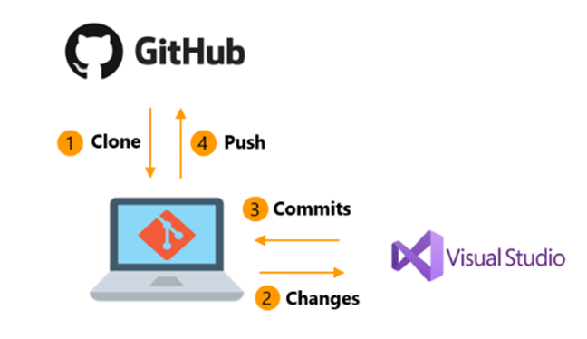

    

&nbsp;

# Join Our Thriving Community on Social Platforms!

Welcome to Genus SO, an ecosystem for young people, trying to make available an array of tools and resources to manage and elevate your career trajectory. Whether you're an aspiring coder, a seasoned programmer, or a tech enthusiast, this platform is tailored to meet your needs. Here's where you can find us:

## GitHub Repository

Our heart and soul reside on GitHub! Explore the codebase, report issues, and submit your pull requests to improve [OpenSourcePlatform]. We value your contributions, no matter how big or small. Head over to our repository and hit that **Star** button to show your support!

GitHub Repository: [Genus Software Github](github.com/genus-so)

## Twitter

Follow us on Twitter for quick updates, project announcements, and interesting discussions. Get a glimpse behind the scenes and connect with fellow developers. Don't forget to mention us (@OpenSourcePlatform) in your tweets – we love hearing from our community!

Twitter: [Genus Software Organization](https://twitter.com/genus_softorg)

## Instagram

Join us on Instagram to explore the visual side of [OpenSourcePlatform]. Follow our account for captivating images, inspiring quotes, and behind-the-scenes glimpses of our development journey. Tap that ❤️ to show your support and be a part of our vibrant community!

Instagram: [Genus SO Instagram](https://www.instagram.com/genus_softorg)

## LinkedIn

For professional networking and thought-provoking articles, join our LinkedIn community. Connect with other developers, exchange ideas, and be part of engaging conversations. Remember to follow our LinkedIn page to receive the latest updates!

LinkedIn

## Discord

Looking for real-time chat and collaboration? Join us on Discord! Our Discord server is a hub for discussions, support, and feedback. Whether you're seeking help or just want to chat with friendly developers, this is the place to be!

Discord Invite Link

## YouTube

Subscribe to our YouTube channel for tutorials, demos, and project showcases. Watch our developers in action, and gain insights into the latest features of Genus SO. Don't forget to hit that notification bell, so you never miss a video!

YouTube Channel

## Spread the Word!

Help us grow our community by sharing Genus SO with your friends and colleagues. Together, we can make this platform even more amazing and impactful. Use the hashtag #OpenSourcePlatform to share your experiences and spread the word about our project!

Thank you for being a part of Genus SO. We look forward to connecting with you on our social platforms and witnessing your contributions to the project!

Happy coding!

The Genus SO Team

<!-- GETTING STARTED WITH GITHUB-->

## Github and Open Source

&nbsp;

    

🚀 To make the most out of this opportunity, we encourage you to learn GitHub, a powerful platform that fosters seamless collaboration and empowers software developers worldwide. 

**Why Github?**

🔍 Here's why understanding GitHub is essential for online teamwork and the open-source process.

**Empowering Online Teamwork:**

👥 GitHub is not just a version control system; it's a game-changer for online teamwork. As you collaborate with teammates during the hackathon, using GitHub will enable you to work cohesively on shared projects. The platform provides a centralized hub where all contributors can efficiently share, review, and track changes in the codebase. Embracing GitHub ensures smoother communication, minimizes conflicts, and accelerates your team's productivity.

**Vital for Software Developers:**

💼 GitHub is a fundamental tool that every software developer should master. It has become an industry-standard for open-source development, showcasing your coding prowess and collaboration skills to potential employers. Understanding GitHub opens doors to contributing to open-source projects, connecting with the developer community, and building an impressive portfolio of your work.

**Take the First Step - Explore Our GitHub Tutorial Video:**

📹 To help you get started on your GitHub journey, we've prepared an easy-to-follow tutorial video. This video will guide you through the basics, from creating your GitHub account to performing common version control actions like cloning repositories, making commits, and submitting pull requests. Whether you're new to GitHub or looking to refine your skills, this tutorial is perfect for all skill levels.

👉 [Click here to access the GitHub tutorial video](https://www.youtube.com/watch?v=nhNq2kIvi9s)

Don't miss out on the incredible opportunities that GitHub can unlock for you! Invest a little time in learning this invaluable tool, and you'll be equipped to thrive in our hackathon's collaborative environment and beyond. Happy learning, and we look forward to witnessing your contributions to our exciting projects!

(<a href="#readme-top">back to top</a>)

## Open Source 

🚀 Ready to embark on an exhilarating journey of innovation, creativity, and boundless opportunities in the world of open-source software projects? 🌟 Join our GitHub community, where talented minds converge, and new horizons are explored. 🌈

👉 [Click here to explore our open-source projects](open-source.md)

**Unleash Your Potential:**
🧠 Our projects are designed to push the boundaries of your imagination. Whether you're a seasoned coder or a budding enthusiast, there's a place for you in our community. 💡 Embrace the challenge, collaborate with brilliant minds, and contribute to meaningful projects.

👥 **A Community of Innovators:**
🤝 At Tech Quests, we celebrate diversity and inclusion. 👫🌍 Our vibrant community spans the globe, connecting developers, designers, and dreamers. Together, we form a collective force driving positive change through technology. Join us to be a part of this inspiring journey.

Let the adventure begin! 🎉

(<a href="#readme-top">back to top</a>)

<!-- LICENSE -->
## License

**Read-Only GitHub Project: No Edits or Usage Allowed**

**Project Description:**
Welcome to our read-only GitHub project! This repository is designed to provide valuable information, code samples, or resources for reference purposes only. While we appreciate your interest in our work, we kindly request that you refrain from making any edits or using the contents in live projects.

**Why Not Editable or Usable?**
There are specific reasons for making this project read-only. It might contain sensitive information, intellectual property, or serve as an archive of historical data that should not be altered. By keeping it read-only, we ensure the preservation of its integrity and originality.

**License and Usage:**
In this case, a license does not apply in the traditional sense, as usage and editing are explicitly prohibited. Instead, the project is shared with the community for educational or informational purposes only. It falls under a "no-license" or "all rights reserved" status, meaning that no permissions are granted to use, modify, or distribute the content.

**Contributions:**
As the project is read-only, contributions, pull requests, and issues will not be accepted. We value your enthusiasm and encourage you to explore other open-source projects where your contributions are welcome.

Thank you for respecting the read-only status of this GitHub project. If you have any questions or need further assistance, feel free to reach out to our team. Happy coding! 🚀🔧

(<a href="#readme-top">back to top</a>)

<!-- CONTACT -->
## Contact

Frederick on twitter - [handle @realfrederick](https://twitter.com/real_frederick)

(<a href="#readme-top">back to top</a>)

