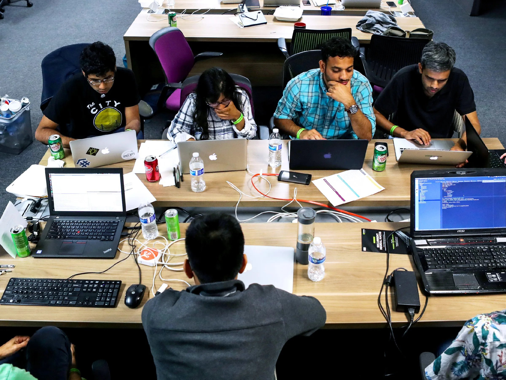

# Process flow for Contributors 🚀

We're excited that you want to contribute to the open-source projects hosted on the Genus Software Platform. This README will guide you through the process of getting started as a contributor.

### How to Contribute 🤝

1. **Create a GitHub Account:** 💻 
   If you don't have one already, sign up for a GitHub account [here](https://github.com/join). This is where all our projects are hosted, and you'll need an account to contribute.

2. **Explore Available Projects:** 🔍 
   Take some time to explore the projects available on our platform. Read their descriptions, check out the source code, and understand their goals.

[Explore the Projects Catalog here → ](projects.md)

4. **Fork the Repository:** 🍴 
   Fork the project's repository to your GitHub account. This will create a copy of the project under your account.

5. **Review Project Contribution Guidelines:** 📜 
   Before you start contributing, please read each project's Contribution Guidelines thoroughly. These guidelines outline our community standards, code of conduct, and best practices for contributing.

6. **Find an Issue or Feature to Work On:** 🎯 
   Visit the GitHub repository of the project you're interested in contributing to. Look for issues labeled as "good first issue" or "help wanted" to find tasks suitable for beginners. Alternatively, you can propose new features or bug fixes.

7. **Set Up the Development Environment:** ⚙️ 
   Follow the instructions in the project's README or CONTRIBUTING.md file to set up your development environment.

8. **Work on the Issue or Feature:** 💻 
   Start coding! Make your changes in your forked repository. Remember to follow the coding conventions and commit guidelines outlined in the project's CONTRIBUTING.md file.

9. **Submit a Pull Request (PR):** 📤 
   Once you're done with your changes, submit a pull request from your forked repository to the original project's repository. Include a detailed description of the changes you've made.

10. **Code Review and Feedback:** 🕵️ 
   Your pull request will be reviewed by the project maintainers and other contributors. Be prepared to address feedback and make improvements based on their comments.

11. **Join the Discussion:** 🗣️ 
   Join our community forum or chat room (Slack, Discord, or any other communication platform) to connect with other contributors, ask questions, and get guidance.

12. **Congratulations! Your Contribution is Merged:** 🎉 
   Once your pull request is approved, your contribution will be merged into the main project. You're now an official contributor to the Genus Software community!

### Code of Conduct 📜

We strive to maintain a friendly, inclusive, and respectful community. Please review our [Code of Conduct](CODE_OF_CONDUCT.md) before participating. If you encounter any issues, please report them to our community moderators.

### Getting Help ❓

If you have any questions or need assistance at any step of the process, don't hesitate to ask for help. Reach out to our community in the forum or chat room, and someone will be happy to assist you.

Thank you for joining us in our mission to promote open-source software development and collaboration. Happy contributing! 🎉.
